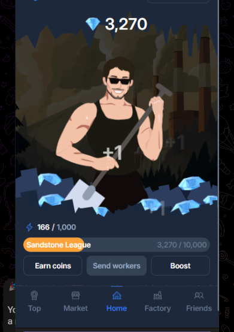

> [!NOTE]
> - Contacts: [Telegram](https://t.me/mudachyo)
> - Channel: [Telegram Channel](https://t.me/shopalenka) 
> - 🇷🇺 README на русском доступен [здесь](README.md)
---
## Как установить
- Install the [Violentmonkey](https://chromewebstore.google.com/detail/violentmonkey/jinjaccalgkegednnccohejagnlnfdag?hl=be) extension in your browser
- For **autoclicker** functionality, install [this script](https://github.com/mudachyo/Friends-Factory/raw/main/ffactory-autoclicker.user.js)
- Open the [Friends Factory Bot](https://web.telegram.org/k/#?tgaddr=tg%3A%2F%2Fresolve%3Fdomain%3Dfabrika%26appname%3Dapp%26startapp%3Dref_363008) and start the game

# Использование
- Open the [Friends Factory Bot](https://web.telegram.org/k/#?tgaddr=tg%3A%2F%2Fresolve%3Fdomain%3Dfabrika%26appname%3Dapp%26startapp%3Dref_363008)
- Open DevTools. For Chrome, use *Ctrl + Shift + J* or *Cmd + Option + J*.
- Press *Ctrl + Shift + M* or enable mobile device emulation 
- Select an iPhone device from the top 
- Start the Friends Factory bot; if a QR code appears, refresh the bot page

## 
---
> [!TIP]
> Other repositories:
> 
> - [Hamster Kombat + Autoclicker](https://github.com/mudachyo/Hamster-Kombat)
> 
> - [TapSwap + Autoclicker](https://github.com/mudachyo/TapSwap)
> 
> - [Blum + Autoclicker](https://github.com/mudachyo/Blum)
>
> - [PixelTap + Autoclicker](https://github.com/mudachyo/PixelTap)
> 
> - [MemeFi + Autoclicker](https://github.com/mudachyo/MemeFi-Coin)
>
> - [Yescoin + Autoclicker](https://github.com/mudachyo/Yescoin)
>
> - [Gemz + Autoclicker](https://github.com/mudachyo/Gemz)
>
> - [Сrossfi + Autoclicker](https://github.com/mudachyo/Crossfi)
>
> - [BUMP + Autoclicker](https://github.com/mudachyo/BUMP)
>
> - [W-Coin + Autoclicker](https://github.com/mudachyo/W-Coin)
>
> - [1win + Autoclicker](https://github.com/mudachyo/1win-Token)
>
> - [Not Pixel + Autoclicker](https://github.com/mudachyo/Not-Pixel)
>
> - [X-Empire + Autoclicker](https://github.com/mudachyo/X-Empire)
>
> - [Tomarket](https://github.com/mudachyo/Tomarket)
>
> - [xKuCoin + Autoclicker](https://github.com/mudachyo/xKuCoin)
---
> [!IMPORTANT] 
> Donation
> 
> - [Donate](https://mudachyo.codes/donate/)
> 
> Donations will be used to maintain the project.